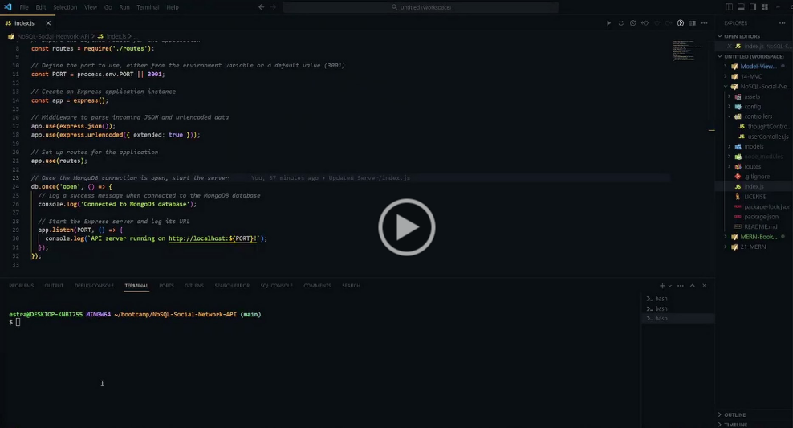

# NoSQL-Social-Network-API

## Description

This project is a social network API that utilizes a NoSQL database. It provides functionality for users to share thoughts, react to friends' thoughts, and manage friend lists. The API is built using Express.js for routing, MongoDB for the database, and Mongoose as the ODM. It's designed to handle large amounts of unstructured data typical in social network applications.

## User Story

```md
AS A social media startup
I WANT an API for my social network that uses a NoSQL database
SO THAT my website can handle large amounts of unstructured data
```

## Acceptance Criteria

```md
GIVEN a social network API
WHEN I enter the command to invoke the application
THEN my server is started and the Mongoose models are synced to the MongoDB database
WHEN I open API GET routes in Insomnia for users and thoughts
THEN the data for each of these routes is displayed in a formatted JSON
WHEN I test API POST, PUT, and DELETE routes in Insomnia
THEN I am able to successfully create, update, and delete users and thoughts in my database
WHEN I test API POST and DELETE routes in Insomnia
THEN I am able to successfully create and delete reactions to thoughts and add and remove friends to a user’s friend list
```

## Link to Google Drive

The following video shows an example of the application being used from the command line amd Insomnia:

[]()

## Screenshot

The following image shows the README application's appearance and functionality:


 
 ## Table of Contents
  - [Description](#description)
  - [User Story](#user-story)
  - [Acceptance Criteria](#acceptance-criteria)
  - [Link to Google Drive](#link-to-google-drive)
  - [Screenshot](#screenshot)
  - [Installation](#installation)
  - [Usage](#usage)
  - [License](#license)
  - [Questions](#questions)

## Usage

## License
[](https://opensource.org/licenses) This project is licensed under the MIT License.

 ## Questions
If you have any questions or encounter any issues, please feel free to [open an issue](https://github.com/mxrtinee/NoSQL-Social-Network-API/issues) or contact me directly:<br>
GitHub: [Mxrtinee](https://github.com/Mxrtinee)<br>
Email: [hello@martinestrada.dev](mailto:hello@martinestrada.dev)