# NoSQL-Social-Network-API

## Description

This project is a social network API that utilizes a NoSQL database. It provides functionality for users to share thoughts, react to friends' thoughts, and manage friend lists. The API is built using Express.js for routing, MongoDB for the database, and Mongoose as the ODM. It's designed to handle large amounts of unstructured data typical in social network applications.

## User Story

```md
AS A social media startup
I WANT an API for my social network that uses a NoSQL database
SO THAT my website can handle large amounts of unstructured data
```

## Acceptance Criteria

```md
GIVEN a social network API
WHEN I enter the command to invoke the application
THEN my server is started and the Mongoose models are synced to the MongoDB database
WHEN I open API GET routes in Insomnia for users and thoughts
THEN the data for each of these routes is displayed in a formatted JSON
WHEN I test API POST, PUT, and DELETE routes in Insomnia
THEN I am able to successfully create, update, and delete users and thoughts in my database
WHEN I test API POST and DELETE routes in Insomnia
THEN I am able to successfully create and delete reactions to thoughts and add and remove friends to a user’s friend list
```

## Link to Google Drive

The following video shows an example of the application being used from the command line amd Insomnia:

[](https://drive.google.com/file/d/1_wFX3sbk7E4Qd54gSUZ38gwiFTVJO75z/view?usp=sharing)

## Screenshots

 The following screenshots shows the application's GET routes to return all users and thoughts being tested in Insomnia:


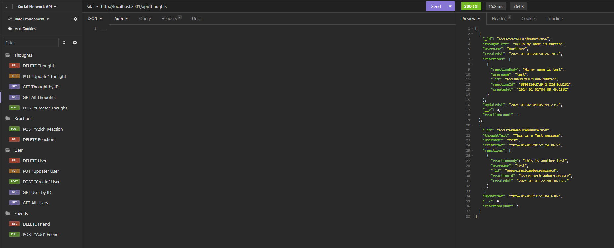

The following screenshots shows the application's GET routes to return a single user and a single thought being tested in Insomnia:


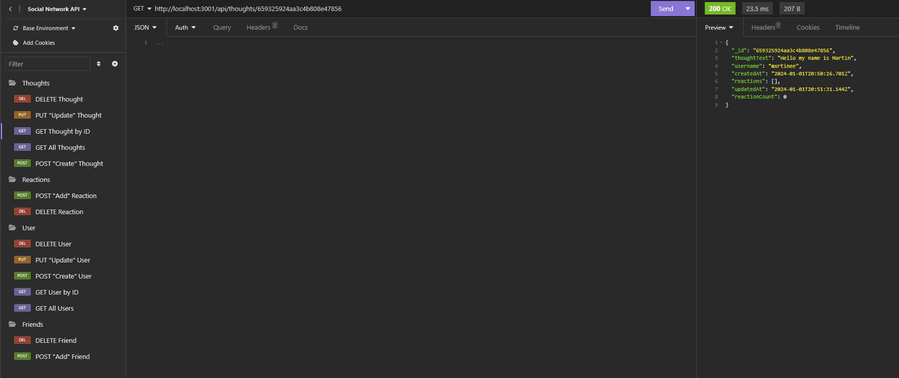

The following screenshots shows the application's POST routes for  being tested in Insomnia:

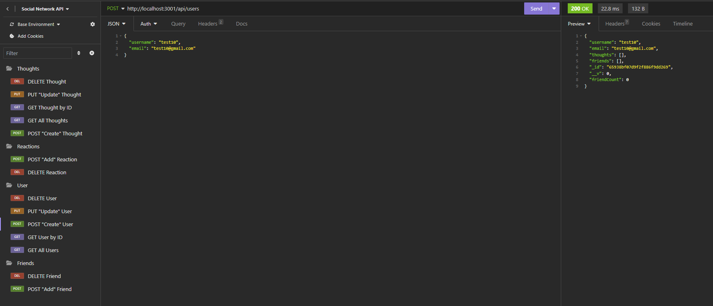

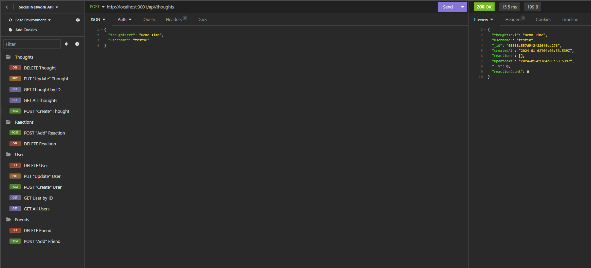

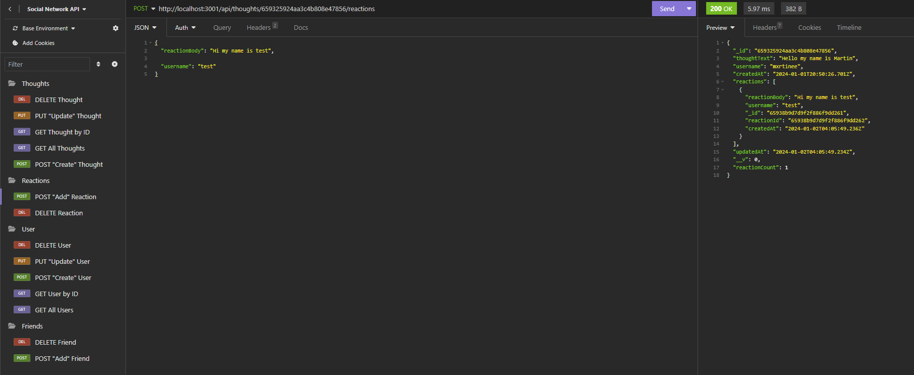

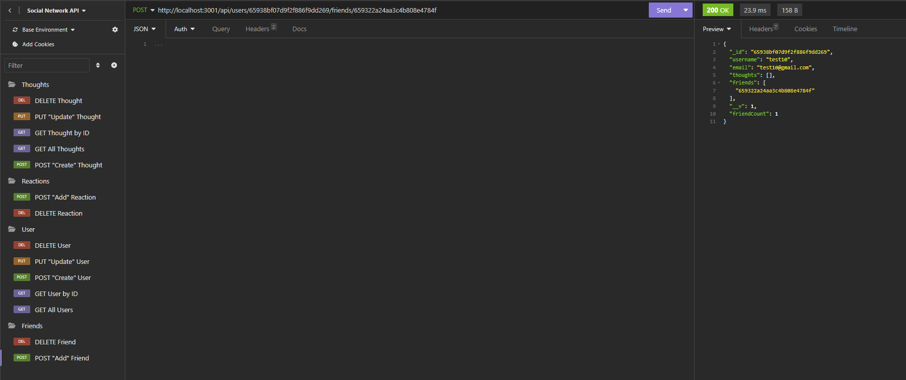

The following screenshots shows the application's PUT routes for  being tested in Insomnia:

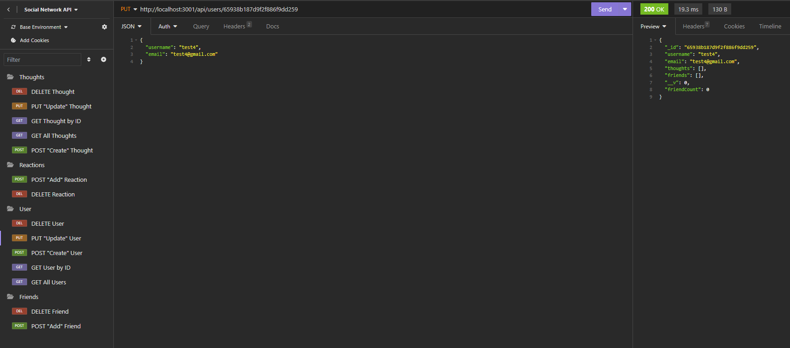

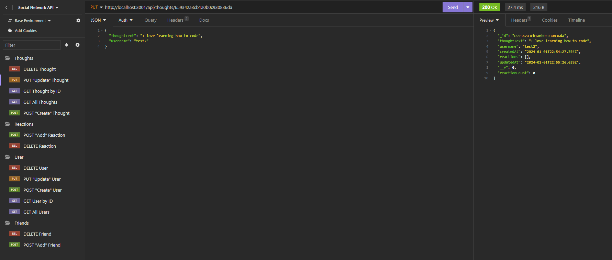

The following screenshots shows the application's DELETE routes for  being tested in Insomnia:

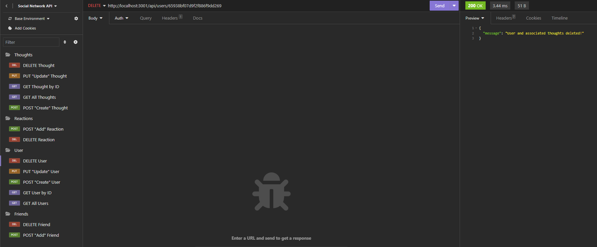

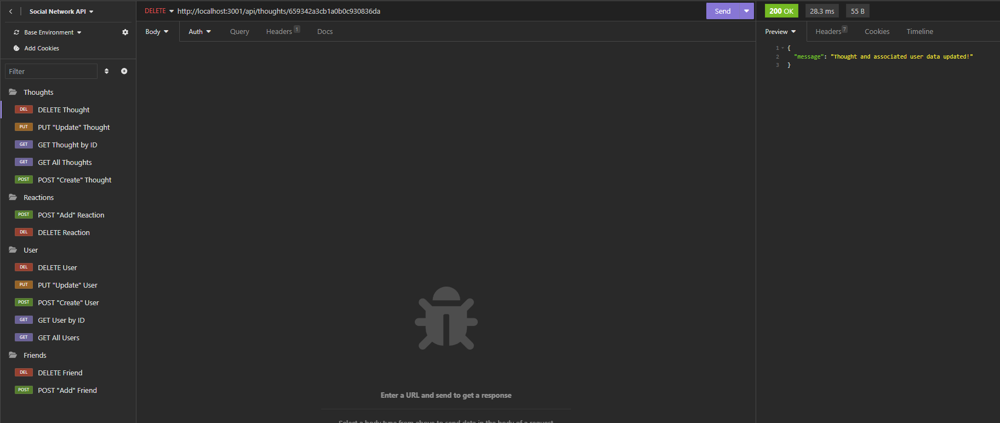

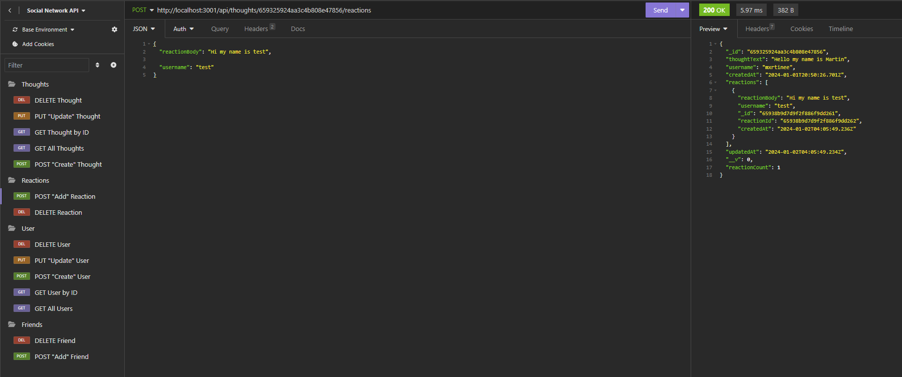

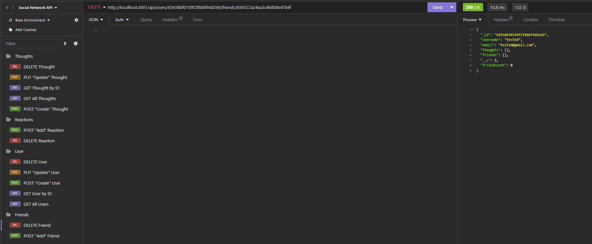

 
 ## Table of Contents
  - [Description](#description)
  - [User Story](#user-story)
  - [Acceptance Criteria](#acceptance-criteria)
  - [Link to Google Drive](#link-to-google-drive)
  - [Screenshot](#screenshots)
  - [Installation](#installation)
  - [Usage](#usage)
  - [Test](#test)
  - [License](#license)
  - [Questions](#questions)

## Installation

Follow these steps to set up the NoSQL Social Network API on your local machine:

### Prerequisites
Before you begin, make sure you have the following software installed:

* Node.js: Download and install Node.js from nodejs.org.

* MongoDB: Download and install MongoDB from mongodb.com.

### Clone the Repository
1. Open your terminal or command prompt.

2. Navigate to the directory where you want to store the project.

3. Run the following command to clone the repository to your local machine:

```md
git clone https://github.com/mxrtinee/NoSQL-Social-Network-API.git
```

### Install Dependencies
1. Change into the project directory:
```md
cd NoSQL-Social-Network-API
```
2. Install the required dependencies by running:
```md
npm install
```
This will install all the necessary packages and modules needed to run the application.

### Start the Server
1. With the dependencies installed, you can start the server by running the following command:
```md
npm run dev
```
This will start the server at http://localhost:3001.

Congratulations! The NoSQL Social Network API is now installed and running on your local machine, ready for you to use and test.

## Usage

### Users
Get All Users

* Endpoint: GET /api/users
* Description: Get a list of all users.

Get Single User

* Endpoint: GET /api/users/:userId
* Description: Get information about a single user by their ID.

Create User

* Endpoint: POST /api/users
* Description: Create a new user. Provide user details in the request body.

Update User

* Endpoint: PUT /api/users/:userId
* Description: Update an existing user's information by their ID. Provide updated user details in the request body.

Delete User

* Endpoint: DELETE /api/users/:userId
* Description: Delete a user by their ID.

Add Friend

* Endpoint: POST /api/users/:userId/friends/:friendId
* Description: Add a friend to a user's friend list.

Delete Friend

* Endpoint: DELETE /api/users/:userId/friends/:friendId
* Description: Remove a friend from a user's friend list.

### Thoughts

Get All Thoughts

* Endpoint: GET /api/thoughts
* Description: Get a list of all thoughts.

Get Single Thought

* Endpoint: GET /api/thoughts/:thoughtId
* Description: Get information about a single thought by its ID.

Create Thought

* Endpoint: POST /api/thoughts
* Description: Create a new thought. Provide thought details in the request body.

Update Thought

* Endpoint: PUT /api/thoughts/:thoughtId
* Description: Update an existing thought by its ID. Provide updated thought details in the request body.

Delete Thought

* Endpoint: DELETE /api/thoughts/:thoughtId
* Description: Delete a thought by its ID.

### Reactions

Add Reaction to Thought

* Endpoint: POST /api/thoughts/:thoughtId/reactions
* Description: Add a reaction to a thought. Provide reaction details in the request body.

Delete Reaction

* Endpoint: DELETE /api/thoughts/:thoughtId/reactions/:reactionId
* Description: Delete a reaction from a thought by its ID.

## Test

You can use tools like Insomnia or Postman to test the API endpoints. Set the base URL to http://localhost:3001/api when making requests.

## License
[](https://opensource.org/licenses) This project is licensed under the MIT License.

 ## Questions
If you have any questions or encounter any issues, please feel free to [open an issue](https://github.com/mxrtinee/NoSQL-Social-Network-API/issues) or contact me directly:<br>
GitHub: [Mxrtinee](https://github.com/Mxrtinee)<br>
Email: [hello@martinestrada.dev](mailto:hello@martinestrada.dev)